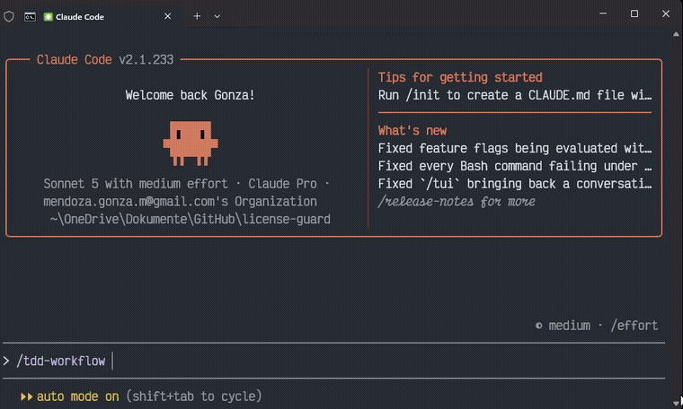

# Claude Code Arsenal

**169 skills · 38 agents** — stop writing the same TDD setup, code review checklist, or ads audit prompt from scratch every project. Install once, invoke by name.  
**169 skills · 38 agentes** — dejá de reescribir el mismo setup de TDD, checklist de code review o prompt de auditoría de ads en cada proyecto. Instalá una vez, invocá por nombre.

[](https://github.com/KratosAR/claude-code-arsenal/actions/workflows/ci.yml)
[](https://github.com/KratosAR/claude-code-arsenal/releases)
[](https://github.com/KratosAR/claude-code-arsenal)
[](./LICENSE)



---

## What is this?

A curated, production-ready collection of Claude Code **skills** and **agents**, packaged as a native [Claude Code plugin marketplace](https://docs.claude.com/en/docs/claude-code/plugins) (also installable via Cowork).

Stop spending hours configuring your AI assistant. Install this once and get:

- **Code review** for 9 languages (TypeScript, Python, Go, Rust, C++, Java, Kotlin, Flutter, Perl)
- **TDD enforcement** — tests first, every time, 80%+ coverage
- **Full paid advertising audits** — Google, Meta, LinkedIn, TikTok, Microsoft, Apple, YouTube
- **Agentic engineering patterns** — parallel agents, eval harness, autonomous loops
- **Architecture & planning** — ADR, API design, database patterns, deployment
- **Content & creative** — ad copy, UI/UX, article writing, research with citations
- **Build error resolvers** for 7 stacks — gets your build green fast

> Pairs well with codebase-context tools like [graft](https://github.com/nanonets/graft) — graft gets Claude the *what* (your codebase structure), arsenal gets it the *how* (battle-tested workflows). → [docs/using-with-graft.md](./docs/using-with-graft.md)

---

## Install in Claude Code (1 minute)

Arsenal is split into 3 packs so you only load the context you'll actually use — install one, two, or all three:

```text
/plugin marketplace add KratosAR/claude-code-arsenal

/plugin install arsenal-core@claude-code-arsenal-marketplace           # 75 skills + 14 agents — TDD, debugging, planning, architecture
/plugin install arsenal-languages@claude-code-arsenal-marketplace      # 45 skills + 14 agents — per-language patterns, testing, reviewers
/plugin install arsenal-marketing-ops@claude-code-arsenal-marketplace  # 49 skills + 10 agents — ads, brand/design, non-coding ops
```

Not sure which one? Start with `arsenal-core` — it's the general dev workflow pack with no language- or industry-specific content.

Also installable via Cowork: **Settings → Plugins → Add marketplace** → `https://github.com/KratosAR/claude-code-arsenal` → branch `main` → Install.

→ Full guide: [docs/quickstart.md](./docs/quickstart.md)

## Local install

```bash
git clone https://github.com/KratosAR/claude-code-arsenal.git
```

---

## Usage

```text
/tdd-workflow          ← enforce test-first on any feature
/systematic-debugging  ← structured bug triage before any fix
/ads-google            ← 74-check Google Ads audit
/ui-ux-pro-max         ← UI design with 50+ styles and 10 stacks
/deep-research         ← cited research from live web sources
/make-plan             ← phased implementation plan
```

Agents are invoked via the `Agent` tool:

```text
Use the code-reviewer agent to review the last changes
Use the planner agent to design this feature
Use the security-reviewer agent before I commit
```

→ See real examples: [examples/](./examples/)

---

## Contributing

Read [CONTRIBUTING.md](./CONTRIBUTING.md) · [SECURITY.md](./SECURITY.md) · [CHANGELOG.md](./CHANGELOG.md)

Branch protection is active on `main`. All PRs require CI to pass + 1 approval.

---

## Credits

Created by [Gonza Mendoza](https://github.com/KratosAR).  
If this project saves you time, leave a ⭐ — it helps others find it.

<!-- CATALOG:START -->
## Catalog / Catalogo

**169 skills · 38 agents across 3 packs** — [Browse the full catalog →](./docs/catalog.md)

| Pack | Skills | Agents | Install |
| --- | --- | --- | --- |
| `arsenal-core` | 75 | 14 | `/plugin install arsenal-core@claude-code-arsenal-marketplace` |
| `arsenal-languages` | 45 | 14 | `/plugin install arsenal-languages@claude-code-arsenal-marketplace` |
| `arsenal-marketing-ops` | 49 | 10 | `/plugin install arsenal-marketing-ops@claude-code-arsenal-marketplace` |

### Featured skills

| Name | What it does |
| --- | --- |
| `ads` | Full-stack paid advertising audit across 7 platforms with 225+ checks |
| `ui-ux-pro-max` | UI/UX design with 50+ styles, 161 palettes, and 10 stacks |
| `tdd-workflow` | Enforces test-first development with 80%+ coverage |
| `deep-research` | Multi-source research via Firecrawl + Exa with citations |
| `systematic-debugging` | Structured bug triage before proposing any fix |
| `make-plan` | Phased implementation plan with documentation discovery |
| `agentic-engineering` | Eval-first execution with cost-aware model routing |
| `codebase-onboarding` | Generates architecture map + CLAUDE.md for any repo |
| `content-engine` | Native content for X, LinkedIn, TikTok, YouTube, newsletters |
| `security-review` | OWASP Top 10 checklist for auth, input, APIs, and secrets |

<!-- CATALOG:END -->
